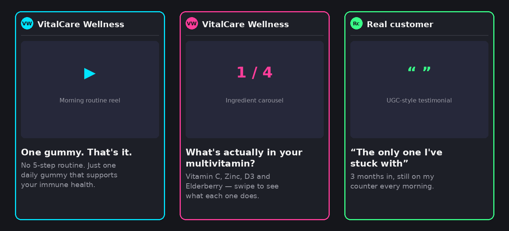
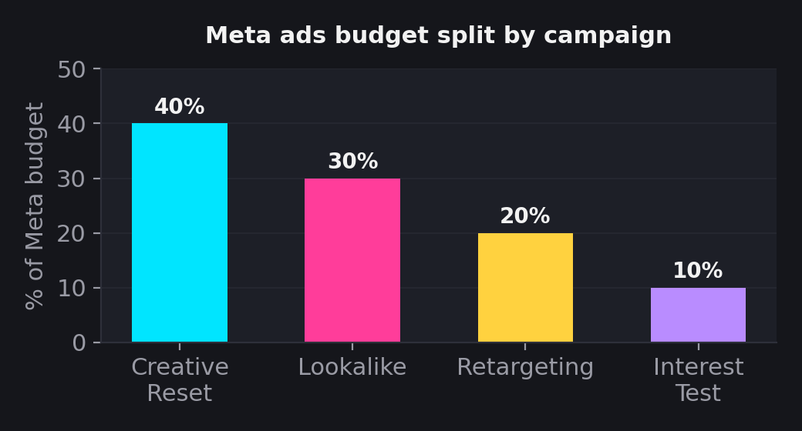
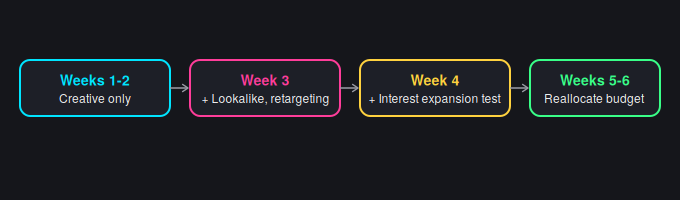
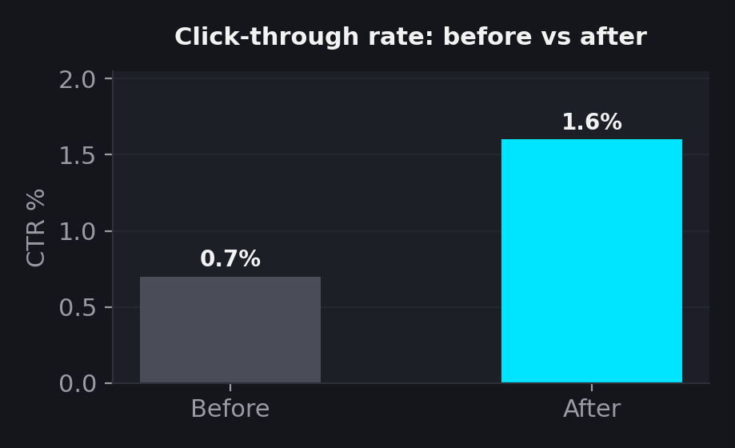
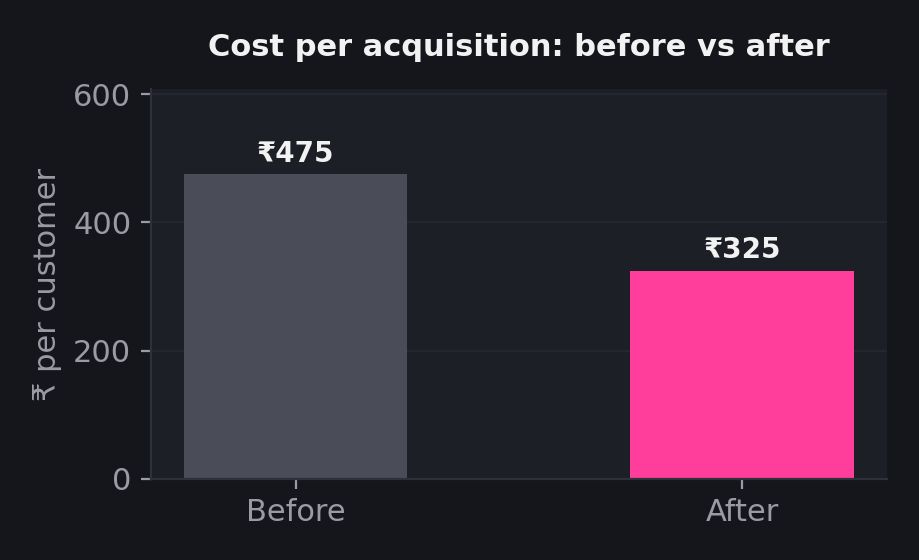
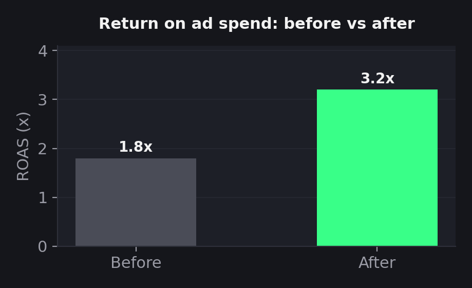

# Ad Campaign Turnaround — VitalCare Wellness
### Simulated Google/Meta Ads audit and recovery case study



`#paid-media` `#google-ads` `#meta-ads` `#healthcare-marketing` `#campaign-audit` `#case-study`

---

## Table of Contents
- [Problem](#problem)
- [Diagnosis](#diagnosis)
- [The Fix](#the-fix)
- [Rebuilt Campaign Structure](#rebuilt-campaign-structure)
- [Phased Rollout](#phased-rollout)
- [Projected Recovery](#projected-recovery)
- [Full Case Study PDF](#full-case-study)

---

## Problem

VitalCare Wellness, an established daily immunity/multivitamin supplement brand (~₹40–50L/month revenue), saw cost-per-customer rise and return on ad spend decline steadily over 6 months — despite no change in product or pricing.

## Diagnosis

**Primary cause: creative fatigue.** The same 3 ad creatives ran unchanged on Meta and Google for 8+ months. As the same audience saw the same ads repeatedly (rising frequency), engagement dropped ("ad blindness"), forcing higher spend to reach the same number of people — driving cost per customer up and ROAS down.

## The Fix

**Primary — Creative refresh:** 5–6 new ad variations (video, carousel, UGC-style) across 3 messaging angles — convenience, ingredient-transparency, and habit/social proof — refreshed every 3–4 weeks going forward.

**Plus — Audience expansion:** Lookalike audiences from existing customers, adjacent interest layers, and geographic expansion — layered on only *after* creative is fixed, so it compounds recovery instead of masking the root cause.

All ad copy avoids restricted health claims ("cures", "prevents", "treats") in favor of compliance-safe "supports" language, with required disclaimers — standard practice for supplement advertising on both platforms.

---

## Rebuilt Campaign Structure



| Meta campaign | Budget | Audience |
|---|---|---|
| Creative Reset (cold) | 40% | Existing cold interest targeting, new creative |
| Lookalike Expansion | 30% | 1–3% lookalike from 6-month purchasers |
| Retargeting | 20% | Site visitors, video viewers, cart abandoners |
| Interest Expansion (test) | 10% | Adjacent wellness/fitness interests |

## Phased Rollout



Phased rollout isolates which fix drives recovery — creative launches alone first, before audience expansion is layered in — rather than changing everything at once.

## Projected Recovery





**Headline number: ROAS projected to nearly double (1.8x → 3.2x)** from fixing creative fatigue alone — without increasing total ad spend. Benchmarks based on Meta's published creative fatigue research, not invented figures.

---

## Full Case Study

For the complete write-up in a single document, see **[case-study.pdf](case-study.pdf)**.

## Files in this repo

```
README.md
case-study.pdf
assets/
  ad-concepts-mockup.png
  rollout-timeline.png
  chart-ctr.png
  chart-cpa.png
  chart-roas.png
  chart-meta-budget.png
```

## Why this project

This project demonstrates paid-media diagnostic skills — auditing an underperforming account, isolating root cause, and rebuilding campaign structure with a phased, testable rollout. It complements the CRM Lead Nurture Campaign (deep execution) and forhim. full-funnel plan (strategic breadth) elsewhere in this portfolio, adding a third skill: fixing what's already broken, not just building new.
